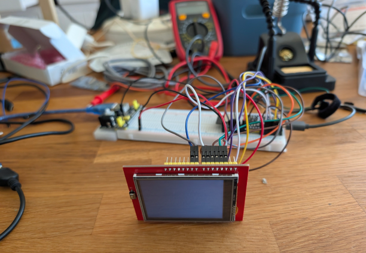
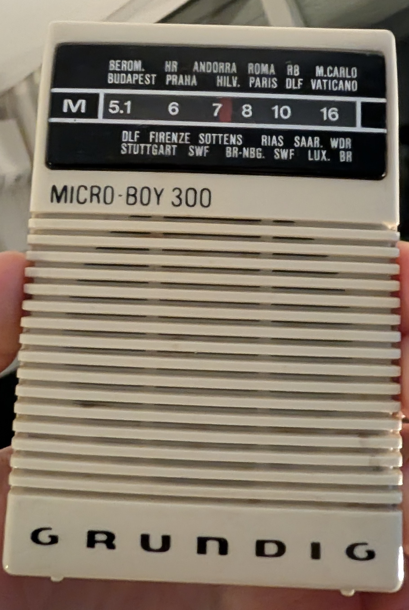

  

# HELIOS-01

Sunrise alarm clock. ESP32-S3 with a 2.4" parallel TFT, talking to Home Assistant
over the native ESPHome API.

**Status: work in progress.** Display and Home Assistant data are working. No sound,
no buttons, still on a breadboard.

## How it works

Home Assistant owns the alarm time and the light ramp — a Zigbee bulb brought up over
20–30 minutes via `light.turn_on` with a transition. The device plays the alarm sound
once the ramp finishes, and shows the clock, the armed alarm and a temperature
reading in the meantime.

Deliberately, the device holds no schedule logic. HA resolves when the next alarm is
and exposes the answer as a single entity; the display just renders it. Keeps the
rules in one place, where they can be debugged in a UI instead of a flash cycle.

## Hardware

- ESP32-S3 DevKitC-1 (N16R8 — 16 MB flash, 8 MB octal PSRAM)
- 2.4" TFT, ILI9341, **8-bit parallel** (not SPI), Arduino shield form factor
- HW-131 breadboard power supply, 5V via its USB-A input
- Planned: MAX98357A + speaker, momentary button, rotary encoder

The parallel bus is driven as octal SPI, with `LCD_WR` as the clock — in 8080 mode WR
is the strobe that latches each byte, which is exactly what a clock does.

## Home Assistant entities

| Entity | Purpose |
|---|---|
| `input_datetime.sunrise_alarm` | Alarm time (time only, no date) |
| `input_boolean.alarm_enabled` | Whether the alarm is armed |
| `sensor.wohnzimmer_temperature` | Template sensor off the thermostat's `current_temperature` |

The device subscribes to these over the API; HA pushes state changes. Nothing to
configure per-entity beyond adopting the device.

## Gotchas

- **`dimensions` is the surface after `transform`, not the native panel.** With
  `swap_xy: true` it must be 320 x 240. Getting this wrong renders as corruption,
  not as an error.
- **20 MHz is the ceiling on breadboard.** 40 MHz inits cleanly and shows nothing.
  Retry it once this is soldered with short wires.
- **A parallel bus is write-only.** Clean logs say nothing about whether an image is
  on screen. Always check the panel.
- **Watch for OTA rollback.** Check the `compiled on` timestamp after every flash,
  and leave power on for the first minute.
- Never use the power module's barrel jack — a 12V adapter put 11V on the 5V rail.

## Setup

`secrets.yaml` is gitignored. Copy `secrets.yaml.example` and fill in WiFi
credentials, an API key (`openssl rand -base64 32`) and an OTA password. Keys and
passwords are per device (`helios_01_api_key`, `helios_01_ota_password`); only the
WiFi credentials are shared.

## Roadmap

1. ~~Display showing clock and HA entities~~
2. Momentary button, backlight wake and auto-dim
3. Rotary encoder setting a number
4. MAX98357A + speaker
5. Alarm scheduling — weekday rules, skip-next, extra-tomorrow
6. Standalone I2S mic for HA voice (prototyped in the Micro-Boy 300, see below)
7. HA / Spotify HUD screen

Most remaining GPIOs are on the buried side of the board, so steps 2–4 need it
reseated or a wider breadboard.

---

  

# Micro-Boy 300

Voice satellite for Home Assistant Assist, headed for the case of a Grundig Micro
Boy 300 pocket radio (8 × 6 × 2.5 cm). The wake word runs on the device; speech
recognition and speech output run locally on the server.

**Status: work in progress.** Wake word, voice commands and the LED status indicator
work on the breadboard. Amplifier, mute switch and push-to-talk button are next;
no audio output yet.

## How it works

The ESP listens for the wake word ("Hey Beepoh", with "Okay Nabu" as backup) using
microWakeWord, then streams audio to HA. The pipeline uses Speech-to-Phrase for
speech-to-text and Piper for the reply, both as a Docker stack in `~/docker/voice`.
The LEDs follow the pipeline state: blue pulse while listening, purple while
thinking, green while replying, red on errors, dim red while muted, off when idle.

A slide switch mutes the mic, a momentary button starts or stops a request without
the wake word.

## Hardware

- ESP32-S3 DevKitC-1 (N16R8), both on the breadboard and in the final build — it
  fits the case with the headers removed
- INMP441 I2S MEMS microphone
- WS2812 ECO strip, 7 LEDs
- Slide switch (mute), momentary button (push-to-talk)
- Planned: MAX98357A + QUARKZMAN 3 W / 4 Ω speaker (44 × 31 × 15 mm), USB-C breakout
  with 5.1 kΩ CC resistors, 1N5819 Schottky diode

| Part | Pins |
|---|---|
| INMP441 | WS GPIO4, SCK GPIO5, SD GPIO6, L/R to GND |
| MAX98357A | LRC GPIO7, BCLK GPIO15, DIN GPIO16 |
| WS2812 | DIN GPIO21 via 330 Ω |
| Mute switch | GPIO10 to GND |
| Push-to-talk | GPIO11 to GND |

## Gotchas

- **Unsoldered headers fail silently.** The INMP441 shipped with loose pins; pressed
  in, the mic delivered pure silence and no error. Solder every header.
- **Speech-to-Phrase, not Whisper.** The server's i3-5010U is too slow for Whisper in
  German. Speech-to-Phrase only knows exposed entities — restart the container after
  exposing or renaming anything.
- **The wake word dropdown in HA shows "unavailable"** (probably the nightly build).
  The first model in the list is active by default, so Hey Beepoh goes first.
- **Debug recordings are public.** `debug_recording_dir` under `/config/www` is served
  under `/local/` without auth. Delete the files and remove the option after
  debugging.
- **Mute is software-only.** Cutting the mic's power doesn't reliably silence it —
  the I2S clocks partly power the chip through its pins.
- **Two 5V sources need a diode.** With the board's USB and the USB-C breakout both
  connected, a Schottky diode (cathode to the 5V rail) keeps the breakout from
  back-feeding the PC.
- **Write lambdas as block scalars.** `lambda: x ? 5 : 0;` on one line breaks YAML
  parsing — the ` : ` reads as a mapping. Use `lambda: |-` and put the code below.
- **LED 0 is skipped** in the breadboard phase — it sits too close to the strip's plug.
  Final build: `num_leds: 7`, partition `from: 0` to `to: 6`.

## Setup

Uses the same shared `secrets.yaml` with its own entries: `micro_boy_300_api_key`
and `micro_boy_300_ota_password`.